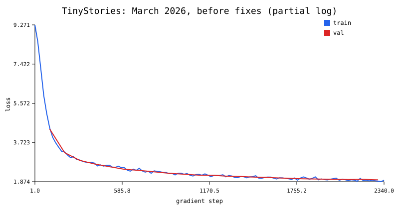

# Transformer Language Model from Scratch

A Python/PyTorch implementation of a decoder-only language model, built by **Guanhua Shao** from the requirements and starter tests in **Stanford CS336, Spring 2025, Assignment 1: Basics**. The project covers byte-level tokenization, Transformer components, optimization, training, evaluation, and text generation.

The repository includes a historical TinyStories run with a **22.7M-parameter model** and a **10,000-token BPE vocabulary**. The current implementation passes **86 tests**, with two platform-dependent memory tests skipped on macOS. Historical model metrics and validation of the corrected code are reported separately below.

## Implementation

- **Tokenization:** byte-level BPE training; Unicode-aware pretokenization; special-token handling; encoding, decoding, and streaming encoding across input chunks.
- **Model:** custom linear and embedding layers, RMSNorm, SwiGLU, causal multi-head self-attention, rotary positional embeddings (RoPE), and pre-norm Transformer blocks.
- **Optimization:** AdamW, stable softmax and cross-entropy, warmup with cosine learning-rate decay, and gradient clipping.
- **Training:** NumPy memory-mapped token data, validation loss/perplexity, model and optimizer checkpoints, and checkpoint restoration.
- **Generation:** temperature scaling, greedy decoding, and top-p sampling.
- **Experiment tracking:** JSON/CSV metrics, saved configurations, loss curves, and optional Weights & Biases logging.

The core model and optimizer components are implemented directly using PyTorch tensor operations and automatic differentiation.

## Results and validation

### Current code: September 21, 2026

```text
.venv/bin/python -m pytest -q
86 passed, 2 skipped in 10.85s
```

The tests exercise tokenization, numerical layers, optimizer updates, serialization, and the production training path. Regression coverage includes split special tokens and Unicode, streaming boundaries, embedding initialization, constructor device/dtype handling, the last valid training window, top-p thresholds, and missing resume files. An integration test performs CPU training, validation, checkpoint saving, and resumed optimization. The two skipped tokenizer memory tests require Linux resource-limit behavior.

A fresh full TinyStories training run has **not** been performed after the September fixes. Passing tests establish component correctness within their coverage; they do not establish new model-quality results or completion of every assignment experiment.

### Historical TinyStories experiment: March 11, 2026

| Item | Recorded value |
| --- | --- |
| Parameters | 22,696,448 |
| Architecture | 4 layers, model width 512, 16 attention heads, FFN width 1,344 |
| Tokenizer / context | 10,000-token BPE / 256 tokens |
| Training | Batch size 64; AdamW; peak learning rate 3e-4; Apple MPS |
| Best logged validation cross-entropy | 1.9591 at step 2,300 |
| Corresponding perplexity | 7.0932 |

These metrics **predate the bug fixes** and are retained as an experiment record. The run used the final 10% of the tokenized TinyStories **training file** as validation, not the official validation set; the tokenizer was trained on that same training file. Validation loss was estimated from 20 randomly sampled batches per evaluation. The committed log ends at step 2,340, before the configured 2,442 steps, and has no completion summary.



*March 2026 partial log, before fixes. Training loss uses individual batches; validation loss averages sampled batches. This is not a result for the corrected implementation.*

Sources: [configuration](results/tinystories-10k-4l-512d/config.json), [metrics CSV](results/tinystories-10k-4l-512d/metrics.csv), and [metrics JSONL](results/tinystories-10k-4l-512d/metrics.jsonl).

## Setup and tests

Requires Python **3.11+**. Install [uv](https://github.com/astral-sh/uv), then run from the repository root:

```bash
uv sync --frozen
uv run python -m pytest -q
```

If the environment already exists, use `.venv/bin/python` in place of `uv run python`. To focus on tokenizer training and the regression suite:

```bash
uv run python -m pytest -q tests/test_train_bpe.py tests/test_streaming_regressions.py tests/test_layer_regressions.py tests/test_training_regressions.py
```

## Quick CPU smoke test

This three-step run requires no dataset download and uses raw UTF-8 bytes as tokens. It checks that training, evaluation, checkpointing, and tracking work; it is too small to produce a useful language model.

```bash
uv run python train_together.py \
  --text 'Once upon a time, a small bird learned to sing. It practiced in the garden every morning. Its friends listened and sang along. Together they made a cheerful song.' \
  --prepared-dir artifacts/readme-smoke/data \
  --experiment-dir artifacts/readme-smoke/runs --run-name cpu-smoke \
  --checkpoint-path artifacts/readme-smoke/checkpoint.pt \
  --vocab-size 256 --d-model 32 --num-layers 1 --num-heads 4 --d-ff 64 \
  --batch-size 2 --seq-len 16 --val-frac 0.25 \
  --steps 3 --warmup-steps 1 --eval-every 1 --eval-batches 1 \
  --log-every 1 --save-every 3 --device cpu
```

## Train a fresh TinyStories model

The workflow below creates **new tokenizer, data, and checkpoint paths** for the corrected code. It uses the official TinyStories train/validation files separately, so its evaluation protocol differs from the historical run above. Dataset downloads and full training are substantially larger tasks than the smoke test.

### 1. Download the data and train BPE

```bash
mkdir -p data
curl -L --fail https://huggingface.co/datasets/roneneldan/TinyStories/resolve/main/TinyStoriesV2-GPT4-train.txt -o data/TinyStoriesV2-GPT4-train.txt
curl -L --fail https://huggingface.co/datasets/roneneldan/TinyStories/resolve/main/TinyStoriesV2-GPT4-valid.txt -o data/TinyStoriesV2-GPT4-valid.txt

uv run python train_tinystories_bpe.py \
  --input-path data/TinyStoriesV2-GPT4-train.txt \
  --vocab-size 10000 \
  --output-dir artifacts/postfix_tinystories_bpe_10k
```

This writes `vocab.pkl`, `merges.pkl`, and `metadata.json`. The default special token is `<|endoftext|>`.

### 2. Encode each split as uint16 token data

This streams text through the tokenizer and writes token IDs in batches. The BPE vocabulary is learned only from the training file.

```bash
uv run python - <<'PY'
from itertools import islice
from pathlib import Path
import numpy as np
from cs336_basics.tokenizer import Tokenizer

tokenizer = Tokenizer.from_files(
    'artifacts/postfix_tinystories_bpe_10k/vocab.pkl',
    'artifacts/postfix_tinystories_bpe_10k/merges.pkl',
    special_tokens=['<|endoftext|>'],
)
output = Path('artifacts/postfix_tinystories_data')
output.mkdir(parents=True, exist_ok=True)
for source, target in [('train', 'train'), ('valid', 'val')]:
    path = Path(f'data/TinyStoriesV2-GPT4-{source}.txt')
    with path.open(encoding='utf-8', newline='') as text, (output / f'{target}.bin').open('wb') as binary:
        ids = iter(tokenizer.encode_iterable(text))
        while batch := list(islice(ids, 65536)):
            np.asarray(batch, dtype=np.uint16).tofile(binary)
    print(f'Wrote {output / (target + ".bin")}')
PY
```

The token-file format is native-endian `uint16`; these commands use a vocabulary well within its 65,536-ID limit. The tokenizer artifacts must stay paired with the encoded data and model checkpoint.

### 3. Train and evaluate

```bash
uv run python train_together.py \
  --train-bin artifacts/postfix_tinystories_data/train.bin \
  --val-bin artifacts/postfix_tinystories_data/val.bin \
  --vocab-size 10000 --d-model 512 --num-layers 4 \
  --num-heads 16 --d-ff 1344 --seq-len 256 \
  --batch-size 16 --steps 2500 --warmup-steps 100 \
  --lr 3e-4 --min-lr 3e-5 --weight-decay 0.01 --grad-clip 1.0 \
  --eval-every 100 --eval-batches 20 --save-every 200 \
  --checkpoint-path artifacts/postfix_tinystories_10k_4l_512d.pt \
  --experiment-dir artifacts/experiments --run-name postfix-tinystories-10k-4l-512d \
  --seed 42 --device auto
```

`auto` selects CUDA, then MPS, then CPU. Reduce `--batch-size` if needed for available memory. Validation runs during training and at the final step, using sampled windows from the supplied validation file. Local run directories contain `config.json`, `metrics.csv`, `metrics.jsonl`, `summary.json`, `loss_vs_step.svg`, and `loss_vs_wallclock.svg`. Add `--wandb` to enable optional remote logging.

To resume an interrupted run, repeat the same training command and add:

```bash
--resume artifacts/postfix_tinystories_10k_4l_512d.pt
```

`--steps` is the **total target step**, not an additional step count. Keep the model, data, and optimizer options consistent. Increasing `--steps` also changes the cosine learning-rate schedule. Checkpoints restore model weights, optimizer state, and iteration; they do not restore random-number-generator state, so a resumed run is not guaranteed to reproduce an uninterrupted trajectory exactly. A missing resume checkpoint raises an error.

### 4. Generate text

```bash
uv run python generate_tinystories.py \
  --checkpoint-path artifacts/postfix_tinystories_10k_4l_512d.pt \
  --tokenizer-vocab artifacts/postfix_tinystories_bpe_10k/vocab.pkl \
  --tokenizer-merges artifacts/postfix_tinystories_bpe_10k/merges.pkl \
  --vocab-size 10000 --d-model 512 --num-layers 4 \
  --num-heads 16 --d-ff 1344 --seq-len 256 \
  --prompt 'Once upon a time' --max-new-tokens 200 \
  --temperature 0.8 --top-p 0.95 --device cpu
```

Use `--temperature 0` for greedy decoding, or `--device mps` on a supported Mac. The generation CLI currently supports CPU and MPS; its model dimensions must match the checkpoint.

## Repository guide

| Path | Purpose |
| --- | --- |
| [`cs336_basics/bpe.py`](cs336_basics/bpe.py) | BPE vocabulary and merge training |
| [`cs336_basics/pretokenization.py`](cs336_basics/pretokenization.py) | Shared streaming pretokenization |
| [`cs336_basics/tokenizer.py`](cs336_basics/tokenizer.py) | Tokenizer loading, encoding, and decoding |
| [`cs336_basics/layers.py`](cs336_basics/layers.py) | Neural-network layers, optimizer, and numerical utilities |
| [`train_together.py`](train_together.py) | Transformer model and training/evaluation CLI |
| [`cs336_basics/decoder.py`](cs336_basics/decoder.py) | Checkpoint loading and sampling |
| [`generate_tinystories.py`](generate_tinystories.py) | Text-generation CLI |
| [`cs336_basics/experiment_tracking.py`](cs336_basics/experiment_tracking.py) | Local metrics, summaries, and plots |
| [`tests/`](tests/) | Assignment tests and added regression tests |
| [`results/`](results/) | Committed historical experiment records |

Datasets, token files, and model checkpoints are excluded from Git; reproduce them with the commands above. The repository also includes an OpenWebText BPE training script, but the results reported here concern TinyStories.

## Attribution and license

Based on the starter repository and [assignment handout](cs336_spring2025_assignment1_basics.pdf) for Stanford CS336, Spring 2025. This is an independent implementation of the assignment, not a claim of Stanford affiliation. The original Stanford University copyright and MIT license are retained in [LICENSE](LICENSE).
